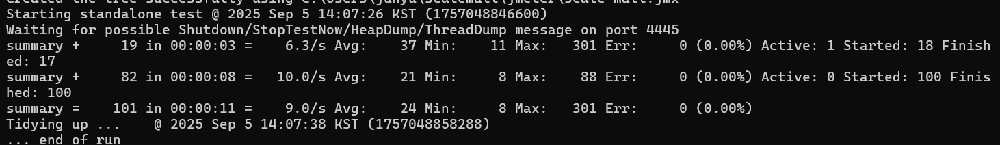

# Scale Mall
- Redis를 활용한 대규모 트래픽 분산 처리 쇼핑몰 프로젝트
- 하나의 한정 상품에 수 많은 고객들이 구매 요청을 하고 이를 제어

---

## 프로젝트 문제 제시 상황

- 쇼핑몰 내에 하나의 한정 상품을 두고 `100 * 10 ^ n` 명의 고객이 구매를 시도함
  - n = 1, 2, ..., 5
  - 상품은 총 `10 * 10 ^ n - 1`개만 준비
  - 중복 구매 불가능: 로그인 없이 clientId CSV를 통해 유저 삽입 및 구매 테스트
- 트래픽 분산 처리 시스템 구현이 목적이므로 로그인 및 사용자 페이지 등의 서비스는 제공하지 않음
- 사용자는 csv 파일에 임의의 clientId를 생성하여 테스트에 사용

---

## 사용기술
- 프론트엔드: Thymeleaf, CSS
- 백엔드: Java, Spring Boot, Spring Webflux, Redis
- Docker(Redis 컨테이너 사용), Apache JMeter(부하 테스트), Git(버전 관리)

---

## 테스트 및 결과
- 테스트 및 결과는 블로그에 작성되었습니다.
  - [기본 코드 구조 설정편](https://velog.io/@bami/Redis-Spring-WebFlux-%EB%8C%80%EA%B7%9C%EB%AA%A8-%ED%8A%B8%EB%9E%98%ED%94%BD-%EC%B2%98%EB%A6%AC-%EC%8B%9C%EC%8A%A4%ED%85%9C)
  - [Jmeter 테스트 수행편](https://velog.io/@bami/Apache-JMeter-%ED%85%8C%EC%8A%A4%ED%8A%B8-%EC%88%98%ED%96%89)

### 100회 부하

- 추가 최적화 없이 개발 직후 수행
- 헬스 체크 평균 37ms, 구매 요청 평균 21ms, 전체 24ms